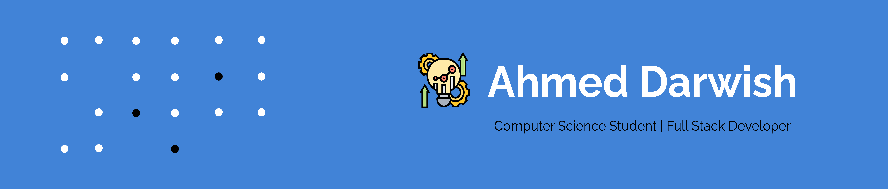

### Hello! I'm Ahmed

I'm a passionate Full Stack developer from Bahrain

**About me**

- 💼 Senior Computer Science Student at [University of Bahrain](https://www.uob.edu.bh/)

- ✉️ You can contact me at [AhmedIT5216@gmail.com](AhmedIT5216@gmail.com)

- 🧠 I'm learning Python and React

- 🤝 I'm open to collaborating on Projects

- 🖥️ My projects:
  - [Events Management System](https://event-management-system-ashlw-87142d6f2532.herokuapp.com/)

### Skills

### Socials

 <a href="https://github.com/AhmedAshlw" target="_blank" rel="noreferrer"> <picture> <source media="(prefers-color-scheme: dark)" srcset="https://raw.githubusercontent.com/danielcranney/readme-generator/main/public/icons/socials/github-dark.svg" /> <source media="(prefers-color-scheme: light)" srcset="https://raw.githubusercontent.com/danielcranney/readme-generator/main/public/icons/socials/github.svg" />  </picture> </a> 

|  |  |
| ------------------------------------------------------------------------------------------------------------------------------------------------------------------------------------------------------------------------------------------------------------ | -------------------------------------------------------------------------------------------------------------------------------------------------------------------------------------------------------------------------------------------- |

